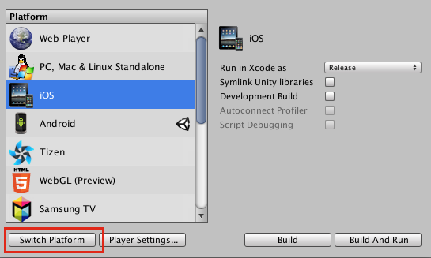
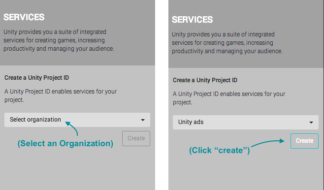
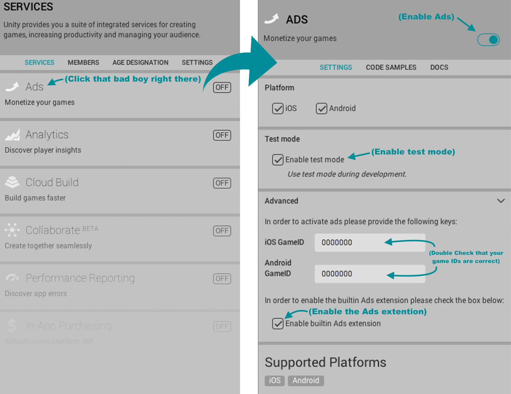
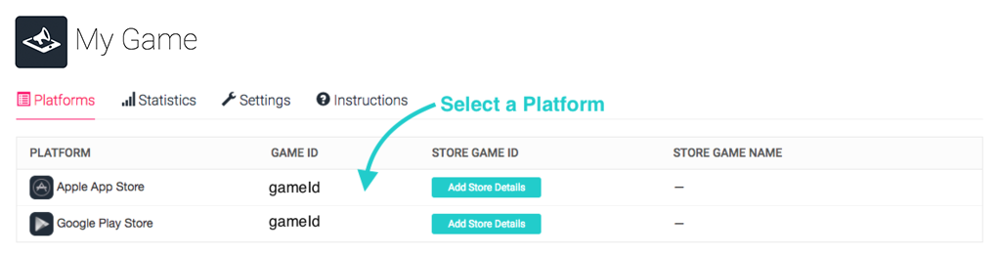
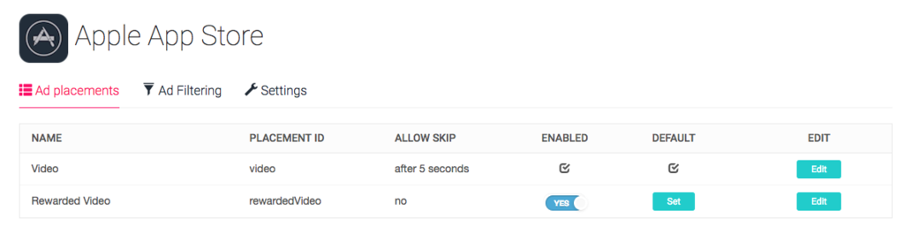

#### Welcome to Unity Ads!

Unity Ads can be enabled directly in **Unity 5.2 or later**.

Click here for Official Unity Ads documentation and additional integration paths:

- [Unity Ads Documentation](https://docs.unity3d.com/Manual/UnityAdsHowTo.html)
- [Unity Ads Knowledge Base](http://unityads.unity3d.com/help/monetization/getting-started)
- [Unity Support Knowledge Base](https://support.unity3d.com/hc/en-us/sections/201163835-Ads)
- [Native iOS integration](http://unityads.unity3d.com/help/monetization/integration-guide-ios)
- [Native Android integration](http://unityads.unity3d.com/help/monetization/integration-guide-android)

# INTEGRATING UNITY ADS

> Updated: November 29th, 2016

### Enable Ads in Unity

First, set the build targets and enable Unity Ads in the Services Panel.

1. Open your game project, or create a new Unity project.
2. Select **Edit > Build Settings**, and set the platform to iOS or Android.
3. Enable Ads in the Unity Services window.



Once that's done, select **Window > Services** 
Select an Organization from the drop down menu:
Click **Create**



Click **Ads**, and enable the SDK in your project:



### Add the code

1. First, declare the Unity Ads namespace in the header of your script:  
 	`using UnityEngine.Advertisements;`

2. You can display an ad by calling the following method:  
	`Advertisement.Show()`

### Example Code
Add a button to your scene that plays an ad, then handles status and callbacks.

  1. Select **Game Object > UI > Button** to add a Button in your scene.
  2. Add the following script to the button.

```csharp
using UnityEngine;
using UnityEngine.UI;
using UnityEngine.Advertisements;

[RequireComponent(typeof(Button))]
public class UnityAdsButton : MonoBehaviour
{
	public string zoneId;

	Button m_Button;

	void Start ()
	{
		m_Button = GetComponent<Button>();

		if (m_Button) m_Button.onClick.AddListener(ShowAdPlacement);
	}

	void Update ()
	{
		if (m_Button)
		{
			if (string.IsNullOrEmpty(zoneId)) zoneId = null;
			m_Button.interactable = Advertisement.IsReady(zoneId);
		}
	}

	void ShowAdPlacement ()
	{
		if (string.IsNullOrEmpty(zoneId)) zoneId = null;

		var options = new ShowOptions();
		options.resultCallback = HandleShowResult;

		Advertisement.Show(zoneId, options);
	}

	void HandleShowResult (ShowResult result)
	{
		switch(result)
		{
		case ShowResult.Finished:
			Debug.Log("Video completed. Offer a reward to the player.");
			break;
		case ShowResult.Skipped:
			Debug.LogWarning("Video was skipped.");
			break;
		case ShowResult.Failed:
			Debug.LogError("Video failed to show.");
			break;
		}
	}
}
```
Then simply press the editor Play button to test the Unity Ads Button integration.

Additional examples and troubleshooting can be found in our [monetization documentation](http://unityads.unity3d.com/help/monetization/integration-guide-unity).
If you have any questions, please post them to the [Unity Ads forum](http://forum.unity3d.com/forums/unity-ads.67) or contact us at unityads-support@unity3d.com

### Reward Players for Watching Ads

Rewarding players can add to user engagement, resulting in higher revenue!

Typically rewarded ad implementation generally involve one or more of the following: 

- In-game currency or consumables
- Extra lives at the start of the game
- Point boosts for the next round

You can reward players for completing a video ad using the **HandleShowResult** callback method in the example above. Be sure to check that the result is **ShowResult.Finished** to verify that the ad was not skipped before granting the reward.

```csharp
private void HandleShowResult (ShowResult result)
if (result == ShowResult.Finished)
{
	//Add code to reward your player here!
	//Give coins, etc
}
```

### Manage Settings in the [Ads Dashboard](https://dashboard.unityads.unity3d.com/Dashboard)

Log into the [Unity Ads dashboard](https://dashboard.unityads.unity3d.com/Dashboard) using your UDN Account, and locate the project for your game.


Then, select a platform (iOS or Android).



From here, you can modify placements and other game-specific settings.



Additional information on placements can be found in our [placements Documentation](http://unityads.unity3d.com/help/monetization/placements).

For additional info, please see the [Unity Ads forum](http://forum.unity3d.com/forums/unity-ads.67), [Unity Ads Knowledge Base](http://unityads.unity3d.com/help/monetization/getting-started), [Unity Ads Documentation](https://docs.unity3d.com/Manual/UnityAdsHowTo.html), [Unity Support Knowledge Base](https://support.unity3d.com/hc/en-us/sections/201163835-Ads), or contact us directly at unityads-support@unity3d.com.

